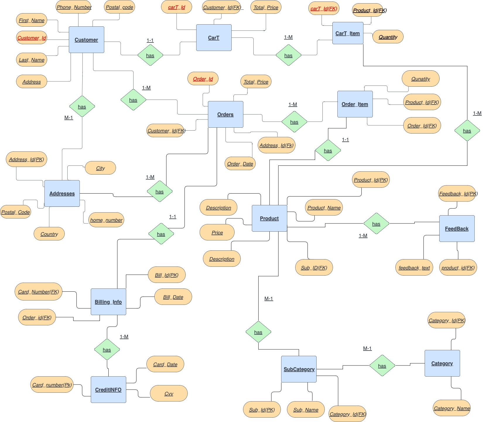

Mukan Yerbolat id:210103036

Sultanov Yerkanat id:210103112

Turganbekov Asylkhan id:210103295

Melis Tileuli id:210107181

## U-Point (e-commerce)

INTRODUCTION

The U-Point is like an I-Point, but little-bit worse. We sell cheap gadgets from China. To do this, we have developed a database system to successfully earn and become super rich.

ENTITY RELATIONSHIP DIAGRAM

1. Customer: This table contains information about customers, including their names, email addresses, phone numbers, and address IDs.

2. Cart: This table stores the details of a customer's shopping cart, including the total price of the items.

3. Cart_Item: This table contains the individual items in a customer's shopping cart, including the product ID and quantity.

4. Orders: This table contains information about customer orders, including the order date, total price, and address ID.

5. Order_Item: This table contains the individual items in a customer's order, including the product ID and quantity.

6. Billing_INFO: This table stores billing information for customer orders, including the bill date and credit card number.

7. Credit_INFO: This table contains information about credit cards used for billing, including the card number and CVV.

8. Product: This table contains information about products for sale, including the product name, description, price, and subcategory ID.

9. SubCategory: This table stores the subcategories to which products belong, including the subcategory name and category ID.

10. Category: This table stores the categories to which subcategories belong, including the category name.

11. Feedback: This table contains feedback from customers about specific products, including the feedback text and product ID.

12. Addresses: This table stores the addresses of customers, including the postal code, country, city, and home number.

